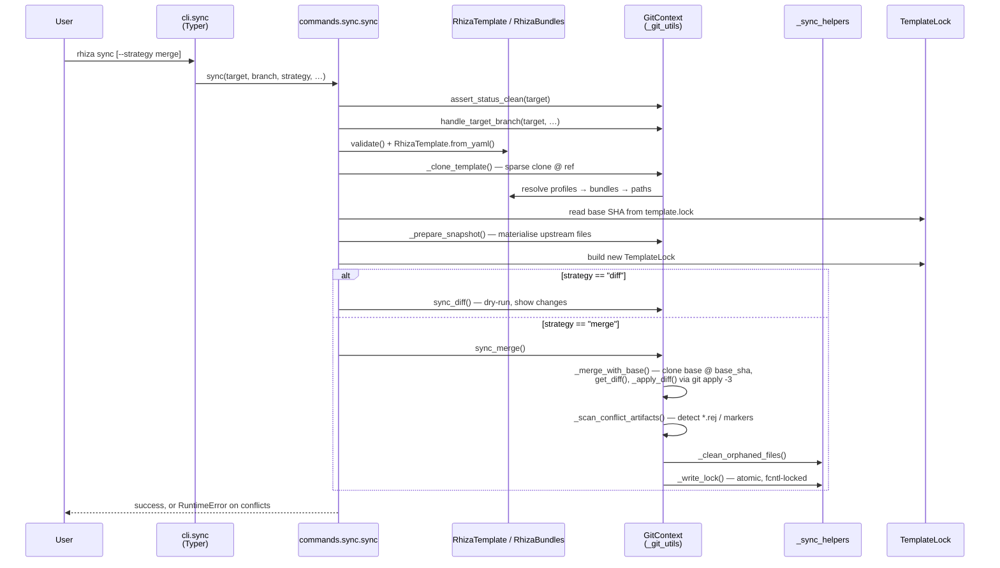

# Architecture

This page maps the Rhiza CLI's source layout and traces a `rhiza sync` call
through the modules end to end. It is the entry point for a new contributor: read
it first, then follow the [Architecture Decision Records](adr/README.md) for the
*why* behind the structure.

## Package layout

The package lives under `src/rhiza/` and splits cleanly into three layers:

| Layer | Location | Responsibility |
|-------|----------|----------------|
| **CLI** | `cli.py`, `__main__.py` | Typer app: argument parsing, option wiring, error-to-exit-code translation. No business logic. |
| **Commands** | `commands/` | One module per subcommand — the orchestration layer. |
| **Models** | `models/` | Data + git engine: config/lock parsing, bundle resolution, and the `git` driver. |

### Commands (`src/rhiza/commands/`)

| Module | Subcommand | Role |
|--------|-----------|------|
| `sync.py` | `rhiza sync` | Primary command — orchestrates the 3-way template merge. |
| `_sync_helpers.py` | — | Internal helpers for `sync`: lock I/O, orphan cleanup, workflow-file warnings. |
| `init.py` | `rhiza init` | Scaffold `.rhiza/template.yml` in a new project; verifies the template repo is reachable. |
| `validate.py` | `rhiza validate` | Validate project structure and `template.yml` against the schema. |
| `status.py` | `rhiza status` | Report the current sync state from the lock file. |
| `tree.py` | `rhiza tree` | Show the resolved file tree a sync would manage. |
| `list_repos.py` | `rhiza list` | List bundles/profiles available in the template repo. |
| `summarise.py` | `rhiza summarise` | Summarise template/bundle contents. |
| `migrate.py` | `rhiza migrate` | Migrate older config layouts to the current schema. |
| `uninstall.py` | `rhiza uninstall` | Remove Rhiza-managed files from a project. |

### Models (`src/rhiza/models/`)

| Module | Public surface | Role |
|--------|---------------|------|
| `template.py` | `RhizaTemplate`, `GitHost` | Parsed `template.yml`: repository, ref, profiles, templates, include/exclude. |
| `lock.py` | `TemplateLock` | Parsed/serialised `template.lock`: synced SHA, tracked `files`, metadata. |
| `bundle.py` | `RhizaBundles`, `ProfileDefinition`, `BundleDefinition` | Resolves profiles → bundle names → concrete file paths. |
| `_git_utils.py` | `GitContext`, `get_git_executable` | The git engine — clone/sparse-checkout, snapshot prep, diff, and `git apply -3` 3-way merge. See [ADR-0004](adr/0004-keep-git-utils-as-single-module.md) for why it is one module. |
| `_base.py` | `YamlSerializable`, `load_model` | Shared YAML (de)serialisation base for the models. |

`language_validators.py` sits at the package root and provides per-language
project-structure checks used by `validate`.

## How a `rhiza sync` flows through the modules

`sync` is the heart of the tool and exercises every layer. The numbered steps
below correspond to the diagram.

Step by step:

1. **`cli.sync`** (`cli.py:197`) parses arguments, rejects unknown strategies,
   and calls the command inside `_exit_on_error(...)`, which converts
   `CalledProcessError` / `RuntimeError` / `ValueError` into a clean exit code.
2. **`commands.sync.sync`** (`commands/sync.py:195`) orchestrates the rest:
   - `GitContext.default()` builds the git driver.
   - `assert_status_clean` refuses to run on a dirty tree;
     `handle_target_branch` optionally creates/checks out a working branch.
   - `_load_template_from_project` runs `validate()` then
     `RhizaTemplate.from_yaml()` to get a validated config.
   - `_clone_template` sparse-clones the template repo at the configured `ref`,
     and (in profile/template mode) resolves **profiles → bundle names →
     concrete paths** via `RhizaBundles`, then narrows the sparse checkout to
     exactly those paths.
   - The previously-synced **base SHA** is read from `TemplateLock`, and
     `_prepare_snapshot` materialises the upstream files (applying `exclude`
     paths and any path remaps) into a temp snapshot.
3. **The merge engine** — `GitContext.sync_merge` (`models/_git_utils.py:471`)
   does the 3-way merge: `_merge_with_base` clones the base snapshot at
   `base_sha`, `get_diff` computes base→upstream, and `_apply_diff` applies it
   with `git apply -3` so local edits survive. `_scan_conflict_artifacts`
   detects any leftover `*.rej` files or conflict markers. On first sync (no
   base), it falls back to a plain copy.
4. **Finalisation** — back in `_sync_helpers`, `_clean_orphaned_files` removes
   files the template no longer tracks, and `_write_lock` writes the refreshed
   `template.lock` atomically under an `fcntl` lock (see
   [ADR-0003](adr/0003-lock-file-concurrency.md)). `sync_merge` returns
   `False` if any conflict remains, which the command surfaces as a
   `RuntimeError`.

The dependency direction is **commands → models**, with one deliberate
exception: `GitContext.sync_merge` imports `_sync_helpers` lazily (a function-local
import) to reuse the lock/orphan helpers without creating an import cycle.

## Why this shape — the ADRs

The non-obvious structural choices are recorded as
[Architecture Decision Records](adr/README.md):

- **[ADR-0001](adr/0001-inline-get-diff-instead-of-cruft.md)** — the diff/patch
  engine (`get_diff` + `git apply -3`) is inlined into the codebase rather than
  depending on `cruft`. This is why `_git_utils.py` owns a diff routine.
- **[ADR-0002](adr/0002-repository-ref-as-canonical-keys.md)** — `repository`
  and `ref` are the canonical keys in `template.yml`, parsed by `RhizaTemplate`.
- **[ADR-0003](adr/0003-lock-file-concurrency.md)** — lock-file writes use
  `fcntl` + atomic rename, implemented in `_sync_helpers._write_lock`.
- **[ADR-0004](adr/0004-keep-git-utils-as-single-module.md)** — `_git_utils.py`
  stays a single ~1000-LOC module: it is one cohesive `GitContext` class plus
  helpers with no independent consumers. Split it only when distinct
  responsibilities with their own consumers emerge.

## What this repo owns vs. what Rhiza owns

This project syncs its own dev infrastructure from the
[`jebel-quant/rhiza`](https://github.com/jebel-quant/rhiza) template — the same
mechanism described above, applied to this repo. Roughly:

- **Locally owned** (the subject of this page): `src/`, `tests/`,
  `pyproject.toml`, `README.md`, the docs under `docs/` (including this file and
  the ADRs), `mkdocs.yml`, and `.rhiza/template.yml`.
- **Rhiza-managed** (synced, not edited in place): `.github/workflows/*`, the
  `Makefile` and `.rhiza/make.d/*`, `.pre-commit-config.yaml`, `pytest.ini`,
  `ruff.toml`, and the `.rhiza/` engine. The authoritative list is the `files:`
  block of `.rhiza/template.lock`; see `CLAUDE.md` for the ownership split.
